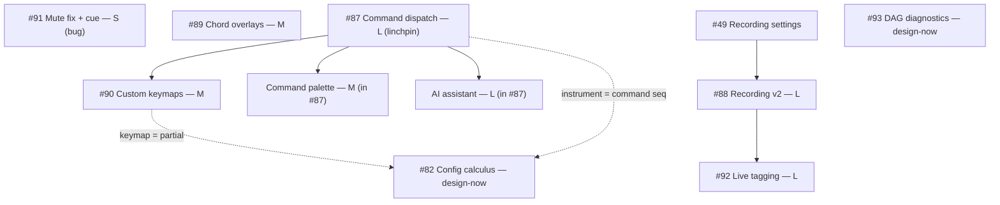

# Thoremin Roadmap

Two horizons:

1. **Near-term feature roadmap** (below) — the concrete, recommended build order
   for the work currently on the table, with dependencies and rationale. This is
   the live planning surface.
2. **Longer-horizon engine milestones (M0–M7)** — the original platform/engine
   arc, kept for reference at the bottom. (Much of the recent work — dials,
   named instruments, hand→sound mapping, feature-accurate overlays, head/face
   pose control — landed *alongside* rather than *inside* this table; it is no
   longer a faithful status board, so read it as direction, not status.)

---

## Near-term feature roadmap (recommended build order — 2026-07)

Design captured across GitHub issues #87–#92 and discussions #81/#93 (each issue
carries a full design-research appendix in its first comment). The order below is
**dependency-driven**, not the order the ideas were raised in — notably the mute
bug is front-loaded for correctness, command dispatch precedes its keyboard
consumer, and recording precedes tagging.

There are **two mostly-independent tracks** that can interleave by appetite:

- **Interaction / control track:** mute fix → command dispatch → its consumers.
- **Capture / training-data track:** recording v2 → live tagging.

Chord overlays sit outside both (self-contained), and are a good early win.

### Tier 1 — correctness + quick visible wins

1. **[#91] Mute fix + visual "muted" cue** — *S · bug · no deps.*
   Mute currently only silences the hand voices (`voice-mapping`); the chord
   nodes (`expression-chord` / `pose-chord`) merge in downstream and bypass it.
   Fix with a **true master mute** (host master gain) + a `muted` store field +
   an unmissable on-screen "muted — press m to unmute" cue. Do first: it is a
   real defect and cheap. *(When #87 lands, `mute` becomes a command.)*

2. **[#89] Chord overlays** — *M · no deps.*
   Two independent, simultaneously-toggleable overlay elements: a **chord-name**
   HUD cue (jazz symbol + optional Roman/Nashville function line) and a thin
   **keyboard-strip** with a shape+brightness visual-cue hierarchy (chord root >
   voiced-now > chord-tone set > scale root). Self-contained, high perceptual
   value, builds on the #84 chord x-labels. Only genuinely-new plumbing: surface
   the **voiced notes** (`SynthParams.voices`) + expose `chordDegree`/`scaleRoot`
   to the overlay.

### Tier 2 — the architectural linchpin

3. **[#87] Command-dispatch layer (acture)** — *L (S core, M with consumers) · unblocks #90 + palette + AI.*
   Make param-mutation the *only* thing that is a command; a command registry
   becomes the single write path into the dials/settings model; the audio/gesture
   hot path stays un-registered and real-time. A **hard refactor** of the write
   path (not a strangler-fig), enforced with an ESLint import firewall. thoremin
   fits unusually well — `setDial`/`resetDial` is already the single write path
   and dials are already Zod schemas. Start the Phase 0–1 hard cut early (it is
   "time soon"), before its consumers; it can run in parallel with the capture
   track.

### Tier 3 — command-dispatch consumers (all depend on #87)

4. **[#90] Custom keyboard mappings** — *M · depends on #87.*
   The first consumer: bind keys → partially-applied param-mutation commands via
   `acture-hotkeys`; **retires the hardcoded `switch`** in `keyboard_control.ts`;
   keymaps are user-editable data saveable as **reusable partials** (the #82
   partial-layer idea applied to keymaps).

5. **Command palette** — *M · part of #87.*
   `acture-palette-react` + `acture-forms-autoform` over the same registry;
   parametrize instruments **live or offline**. (Tracked inside #87 for now;
   split into its own issue when started.)

6. **AI assistant** — *✅ SHIPPED 2026-07-10 (#87 Phase 3, PR #111).*
   A new in-app **Assistant** plugin (`src/plugins/assistant/`) — a chat that
   operates the instrument by dispatching the command registry via
   `acture-ai-vercel`. **Client-side, multi-provider, BYO-key** (OpenAI /
   Anthropic / **Google — default Gemini 3.5 Flash**); **no aix** — thoremin
   stays client-side, with a pluggable `ChatBackend` seam for a future
   server-side move. A human-in-the-loop **confirmation gate** guards the
   destructive `instrument.*` commands. Lazy-loaded so the AI SDK stays out of
   the initial bundle. Deferred: `acture-mcp-server` for external agents.

### Tier 4 — capture / training-data track (parallel to Tiers 2–3)

7. **[#88] Recording v2** — *L · extends #49 · prereq for #92.*
   Session-based multi-stream recorder: settings move **out of the instrument**
   into a transient sheet (Record → sheet → "Rec now" in the same slot); five
   capturable streams (audio, video+overlays, pure-webcam, overlay-only,
   feature-JSONL); **one folder per recording** with an info-carrying naming
   scheme; a `manifest.json` for cross-stream time alignment; a three-tier local
   sink (dir handle / ZIP / per-file). Independent of the command-dispatch track.

8. **[#92] Live tagging mode** — *L · depends on #88 · research in #81.*
   Toggle tags during a recording → a time-aligned `tags.jsonl` that segments the
   streams for ML/analysis. Interval+point tags, mutual-exclusivity groups,
   1..9 keyboard toggles, per-tag lead-in + countdown, blinking open-tag buttons,
   a burned-in corner overlay as the ground-truth clock. Built to **extract into
   a reusable zodal tool** (`taglog`: affordances / provider / presentation).

### Stream Applier / alternative sources (active — 2026-07)

A third track, cutting across both above: separate *what runs* (the DAG) from
*how we apply it to a stream*. One open-closed **Applier** applies the DAG to a
**source-set** (live sensors / persisted data / generator functions, all behind
one async-iterator interface) under a **clock** (batch-unpaced vs time-paced with
speed control), with taps for recording and sinks for view/hear. Enables:
camera-free runs from a pre-recorded video, state-feedback generator sources, and
deterministic headless replay. Full design + build order (M-A…M-G) in
[design/stream-applier.md](design/stream-applier.md); tracked in the **Stream
Applier epic** issue.

- **M-A [P0]** — camera-free pre-recorded video source (`?source=video`). Pure
  host wiring, no engine change; **unblocks camera-free #89 overlay + palette
  verification.** Do first.
- **M-B [P1]** — `Clock` abstraction + speed multiplier.
- **M-C [P1]** — the async-iterator `Source` contract + `source` slot + port
  conformance.
- **M-D…M-G** — the Applier, composition/mixing, state-feedback generators, and
  the principled end-state (honest scaled audio + `delay` node). See the design
  doc.

Two accepted hard boundaries: batch-in-Node cannot decode raw video (use
pre-extracted landmark NDJSON), and accelerated audio is not a time-multiply
(control-rate preview + on-demand offline render).

### Instrument library UX (2026-07 — active track)

Make the instrument library browsable and self-describing. Orthogonal to the DAG
/ capture / applier tracks. Epic **#116**, build order:

- **[#112] Starring & sorting** — *S · independent, good first win.* Multi-star
  favorites; sort by star/name; filter by name. Move "default" **out of the star**
  into each instrument's own settings + a `(default)` visual cue.
- **[#113] Tag system** — *M · foundation for #114.* Tags as
  `{ stable id, editable label, emoji }` (renames never break associations);
  comma-input tagging with autosuggest; a tag manager (rename / emoji / delete);
  a tags column with emoji tooltips. Client-side emoji: keyword search
  (`emojilib`/`node-emoji`) + auto-assign from a curated ~100-emoji pool.
- **[#114] System tags** — *M · depends on #113.* Read-only tags derived from
  parametrization (scale quality M/m/P/p, face-expression vs face/head-pose
  control, index vs wrist note-control, …), kept separate from custom tags.
- **[#115] Parametrization tooltip** — *S · independent.* A compact per-instrument
  hover summary (more than the list row, less than the settings editor); can share
  a `summarizeInstrument()` helper with #114.

Relationship to **#82** (config calculus): tags are orthogonal metadata; system
tags are a read-only *view* of the same parametrization #82 formalizes.

### Design now, build later (parallel design track)

- **[#93] DAG diagnostics + connection assistant** — *L · design captured.*
  A "linter for the instrument graph": a severity-typed notes/warnings panel +
  a connection assistant (find connectable components, flag dangling state). The
  pure analyzers + notes panel are buildable headless today (seam:
  `@zodal/dials-ui` `state.validation`); mid-drag compatibility highlighting
  waits on the visual patcher (#14). Full design in discussion #93.

- **[#82] Configuration calculus (composable instruments)** — *design captured.*
  Partial instruments (sparse dials Layers) + transformers that mix into new
  instruments. Fed by both #90 (a keymap is a partial) and #87 (a materialized
  instrument is a replayable command sequence).

- **[#75] Decouple the chord-source scale from the melody scale** — *✅ SHIPPED 2026-07-10.*
  Chords are drawn from a decoupled chord-source scale (auto-derived from the melody, or
  custom), so a pentatonic melody still gets chords and the 7-note-scale friction on the
  chord/`controls` face modes is gone. Shipped alongside **[#63] the double-thumb octave-RANGE
  slider** (1–3 octaves, locked middle) in the same PR (`faceChord.chordSource/chordRoot/
  chordType`; per-voice `rangeLow/rangeHigh`; store persist v6).

- **[#76] Head-pose follow-ups** — per-axis live-tuning UI, per-user calibration
  (the `*ZeroDeg` seam exists), and Phase 4 (demote the emotion classifier to
  opt-in once `controls` proves out). Plus the open **axis-sign live check**.

### Dependency map

---

## Longer-horizon engine milestones (M0–M7)

Incremental engine/platform milestones from the original DAG build. Kept for
direction; **not** a current status board (recent feature work landed alongside
these rather than inside them).

| Milestone | Goal | Status |
|-----------|------|--------|
| **M0** | Baseline + layer contract: DAG engine, recorder/replay, pure node library, music theory, headless tests. | ✅ done |
| **M1** | First real video→sound vertical slice in the browser, on-device. | ✅ done |
| **M2** | Fixture record/replay infra + persisted per-edge feature streams on disk + CI gate. | ✅ done |
| **M3** | Refactor the working Lyria app (`wips/`) into a `lyria` generative node + `indirect-map` node (indirect mapping / conductor-of-AI). | ⏳ (issues #6, #8) |
| **M4** | Broaden input/feature layer (`face-features` 52 blendshapes, `pose-features`, `gesture-classifier`) + tonal depth (Tonal.js chords/voicing/progression, Tone.js Transport quantization). | partial (face landmarks/pose control shipped; #9–#11 open) |
| **M5** | Conductor mode: immutable `score` node + `performance` overlay (gesture→tempo/dynamics/articulation) + humanization toggle. | planned (#12) |
| **M6** | `midi-out` (WEBMIDI.js, Safari/iOS gated); React Flow patcher UI driven by Zod node configs; deploy as a tw_platform static app (deploy ✅). | planned (#13, #14) |
| **M7** | (optional) Pluggable Python feature service + self-hosted generative service behind the existing node facades. | optional |
| **M8** | **Stream Applier**: pluggable sources (live / persisted / generated behind one async-iterator interface) + batch-vs-paced execution (speed control) + state-feedback generators. See [design/stream-applier.md](design/stream-applier.md). **M-A unblocks camera-free overlay/palette verification.** | ⏳ in progress (M-A) |

### Open engine decisions (recorded; defaults taken)

1. **Lyria API key** — ship key-in-localStorage now; thin proxy or
   platform-managed key later. *(gates M3)*
2. **Music theory lib** — keep the hand-rolled snapping on the hot path; add
   Tonal.js for chords/voicing/progression in M4.
3. **Synth engine** — Web Audio oscillator now; adopt Tone.js when richer
   voices/effects/Transport are needed.
4. **On-device vs backend** — frontend-only now; keep node interfaces clean so a
   Python/`theremin` or generative service can plug in later (M7).
5. **Fixture videos** — commit small derived NDJSON; raw `.mp4`s optional/external.
